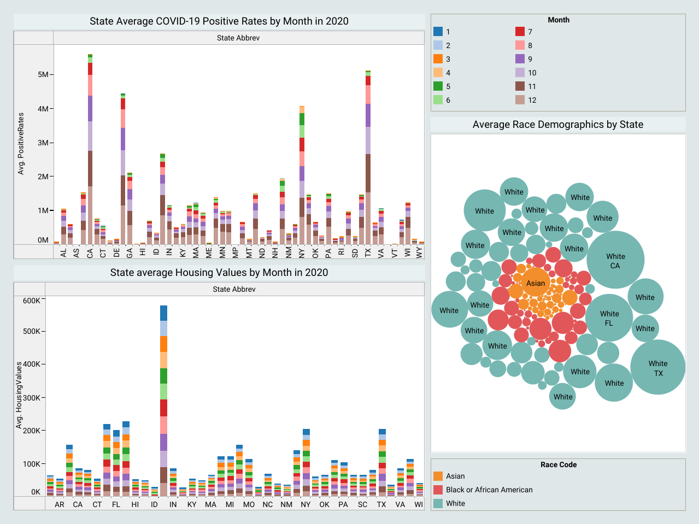

# CIS9440_FinalProject
# The impact of COVID-19 on home values in Black communities 
- author(s): Karina Williams
- date created: 20210516
- class: CIS 9440

Project Objective: Follow the Kimball Lifecycle to design and develop a public, cloud-based Data Warehouse with a functioning BI Applications

Project Tools:
The tools used to build this Data Warehouse were:
1. For data integration - Python
2. For data warehousing - Google BigQuery
3. For Business Intelligence - Tableau

## Kimball Lifecycle Project Stages

### Project Planning

Motivation for project:
Trends depicted in recent news articles highlight the negative impact of COVID-19 on black and BIPOC families and communities, but it is also emphasized that the impact is most heavily felt by black women particularly those with children and families.  The question then arises is this primarily due to the pandemic and its affects or was this a trend that could have been tracked and anticipated but has just been accelerated due to COVID-19.

Description of the issues or opportunities the project will address:
- Identification of communities and demographics that would most benefit from lower cost housing options
- Opportunities for improved social programs and intervention 
- Identification of gaps in housing policy 
- A future stretch goal would be to link available pre-existing condition health data to the housing and pandemic datasets to infer if a higher risk of preexisting comorbidities played a role in the increased impact on these communities.  

Project Business or Organization Value:
- Local state housing authorities can use these numbers to estimate the current effects of the Pandemic as well as the repercussions of these trends.  Identifying opportunities for the implementation of improved initiatives. 
- Zillow can use these visuals to identify future markets for sale as well as outreach markets for more affordable housing options. 

Data Sources:
1. General large dataset of COVID-19 cases (https://covidtracking.com/data/download)
2. Zillow Housing Data (https://www.zillow.com/research/data/)
3. State Race Demographics (https://www.governing.com/now/State-Population-By-Race-Ethnicity-Data.html) 

### Business Requirements Definition

List of Data Warehouse KPI's:
1. State Average COVID-19 Positive Rates by Month in 2020
2. Average Race Demographics by State
3. Month over Month comparison of Housing Values in the 5 States with the Highest Positive COVID-19 Rates from 2019 to 2020
4. Month over Month comparison of Housing Values in the 5 States with the Highest Positive COVID-19 Rates from 2020 to 2021
5. Average Race Demographics in the 5 States with the Highest Positive COVID-19 Rates

### Dimensional Model

This project's Dimensional Model consists of 3 Facts and 3 Dimensions

This project's Kimball Bus Matrix:

### Business Intelligence Design and Development

List of Visualizations for each KPI:
1. Horizontal Bar Chart for comparison of the monthly average of COVID-19 positive cases for each State in 2020
2. Horizontal Bar Chart for comparison of the monthly average of COVID-19 positive cases in the 5 States with the Highest Positive COVID-19 Rates from 2019 to 2020
3. Horizontal Bar Chart for comparison of the monthly average of COVID-19 positive cases in the 5 States with the Highest Positive COVID-19 Rates from 2020 to 2021
4. Packed Bubbles for comparison of the Average Race Demographics by State
5. Packed Bubbles for comparison of the Average Race Demographics in the 5 States with the Highest Positive COVID-19 Rates

BI Application Wireframe design:

Picture of final Dashboards:

### Deployment

The project was deployed on Tableau Public: 
- https://public.tableau.com/profile/karina.williams#!/vizhome/CIS9440_Group5_Milestone_4/FInalProjectDashboard
- https://public.tableau.com/profile/karina.williams#!/vizhome/CIS9440_Group5_Milestone_4_2ndDash/FInalProjectDashboard2
